  

---

## 👋 About Me

I am a **Senior DevOps Engineer & Site Reliability Engineer (SRE)** dedicated to architecting highly available, secure, and cost-optimized cloud-native infrastructure. I specialize in bridging the gap between development and operations through zero-touch automation, declarative infrastructure, and shift-left security.

* 🔭 **Currently Building**: Multi-region Kubernetes (EKS) platforms using modular Terraform & ArgoCD GitOps pipelines.
* 🛡️ **Security Philosophy**: DevSecOps first—automated container CVE scanning, least-privilege IAM IRSA, and 100% KMS encryption.
* 💡 **Core Methodologies**: GitOps, Infrastructure as Code (IaC), Zero-Trust Architecture, Chaos Engineering, and FinOps cloud optimization.
* 📬 **Get In Touch**: Check out my flagship portfolio projects below or reach out via LinkedIn/Email!

---

## 🛠️ My Cloud Native & DevOps Tech Stack

### ☁️ Cloud Platforms & Infrastructure as Code

### ☸️ Containerization, Orchestration & GitOps

### 📊 Observability, SRE & Telemetry

### 🔐 DevSecOps & CI/CD Pipelines

---

## 🌟 Flagship Portfolio Repositories

Here are my featured cloud engineering architectures, built from scratch with production-grade standards:

| 🏗️ Project & Repository | 🚀 Description & Architectural Highlights | 🛠️ Tech Stack |
| :--- | :--- | :--- |
| **[terraform-aws-enterprise-eks](./01-terraform-aws-enterprise-eks)** | **Enterprise AWS Kubernetes Infrastructure as Code** • Highly Available 3-AZ EKS cluster with least-privilege IRSA. • Automated FinOps with 70% Spot instance cost savings & Infracost CI/CD. • Automated static security scanning via Checkov and tfsec. | `Terraform`, `AWS EKS`, `VPC`, `KMS`, `GitHub Actions` |
| **[gitops-argocd-observability](./02-gitops-argocd-observability)** | **Continuous Delivery & Full-Stack Observability Platform** • 1-Click GitOps App-of-Apps bootstrap with zero human intervention. • Self-healing automated sync with drift remediation. • Complete Prometheus, Grafana & Alertmanager SRE telemetry stack. | `ArgoCD`, `Kubernetes`, `Helm`, `Prometheus`, `Grafana` |
| **[devsecops-cicd-pipeline](./03-devsecops-cicd-pipeline-showcase)** | **Software Supply Chain Security & Container Hardening** • Automated SAST linting, unit testing, and code quality checks. • Non-root distroless multi-arch container builds (`amd64`/`arm64`). • 0-CVE container vulnerability scanning with Trivy & Syft SBOM generation. | `Docker`, `Trivy`, `Syft`, `FastAPI`, `GitHub Actions` |

---

## 🏗️ My Cloud Engineering & GitOps Workflow

```mermaid
graph LR
    subgraph Dev_Environment ["💻 Engineering Workstation"]
        Code["Terraform & Helm Code"]
        Git["Git Commit & Sign"]
    end

    subgraph CI_CD_Pipeline ["⚡ Automated DevSecOps Pipeline"]
        Lint["SAST / Flake8 / tflint"]
        Scan["Trivy CVE & Checkov Security Scan"]
        Build["Multi-Arch Build & SBOM"]
    end

    subgraph Cloud_Production ["☁️ AWS EKS Live Cluster"]
        Argo["🚀 ArgoCD GitOps Sync"]
        Pods["📦 Auto-Scaled Workloads (HPA)"]
        Obs["📊 Grafana / Prometheus Telemetry"]
    end

    Code --> Git -->|"Push PR"| Lint --> Scan --> Build
    Build -->|"Publish Artifact"| Argo
    Argo -->|"Self-Heal Sync"| Pods
    Pods -.->|"Metrics & Logs"| Obs
```

---

## 📈 GitHub Stats & SRE Telemetry

  
  

 

  

---

  ⚡ Automated and maintained with GitOps precision • Designed for 99.99% Reliability

